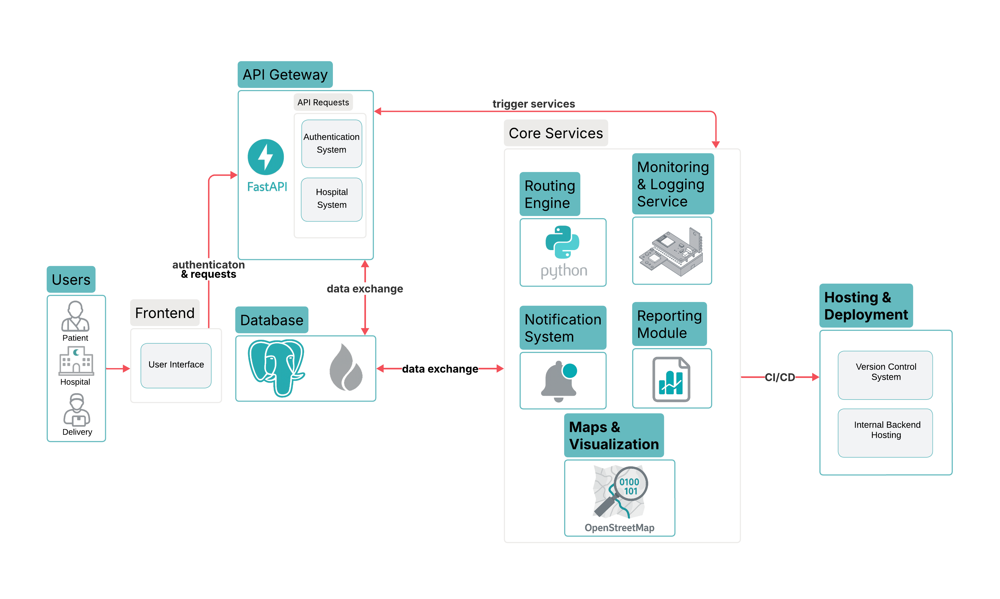

# Teryaq | ترياق
Smart cold-chain medication delivery & monitoring system (IoT + Routing + Multi-role Apps + ML)

## Project Overview
Teryaq is a cold-chain delivery platform designed to keep **temperature-sensitive medications safe during transportation**. It integrates an IoT monitoring device (temperature + GPS), a backend service layer for operations and analytics, and **three Flutter applications** for **Patient / Hospital / Driver** roles. The system supports real-time tracking, stability monitoring, alerts, reports, routing, and operational workflows from prescription to delivery completion.

## Demo
A recorded demo is available and contains more details about the project, including a video demonstrating the interface and how each screen is used live (captured from the real running application).
- https://www.canva.com/design/DAG74NkUXW8/Ht80OQyIMl1U-HDLrD5nAw/view?utm_content=DAG74NkUXW8&utm_campaign=designshare&utm_medium=link2&utm_source=uniquelinks&utlId=h0cafe79df0#43

## Key Capabilities
- **Multi-role platform (Flutter):**
  - Patient: orders, tracking, dashboard, reports, notifications, chatbot
  - Hospital: patient/prescription management, order approvals, reporting
  - Driver: today’s deliveries, live map dashboard, OTP delivery confirmation, notifications
- **IoT Monitoring Device:**
  - Temperature sensing + GPS tracking during delivery
  - Live telemetry ingestion to backend for monitoring and reporting
- **Cold-chain Stability Monitoring (Remaining Stability Duration):**
  - Tracks allowable excursion time when temperature goes outside safe range
  - Flags unsafe conditions when excursion limits are exceeded or violations occur
  - Generates alerts/notifications for unsafe events in real time
- **Mapping & Routing (Self-hosted stack):**
  - OSRM for route computation and ETA (based on OpenStreetMap data)
  - TileServer-GL for fast, reliable map tile rendering in the apps
- **Route Optimization (VRP / VRPTW):**
  - Delivery route planning using metaheuristics (e.g., HGS/GLS/SA experiments)
  - Supports multiple stops and operational constraints (time windows where applicable)
- **Recommendation System (Delivery vs Pickup):**
  - Predicts whether delivery or pickup is more suitable based on patient/order context
  - Exposes prediction through backend endpoints and UI decision flow
- **Data Pipeline (Collection → Cleaning → Training):**
  - Data collection (including scraping sources)
  - Preprocessing/cleaning + feature engineering
  - Model training + evaluation, and synthetic data generation (SDV) for safe experimentation
- **Chatbot (Deterministic + LLM Rephrasing):**
  - Intent resolution (UI navigation vs medication-related questions)
  - Rule-based answers from approved knowledge
  - LLM used only to rephrase output to improve clarity while avoiding hallucinations

## Architecture


## Tech Stack (high level)
- Mobile: Flutter + Dart (Patient / Hospital / Driver apps)
- Backend: FastAPI (REST APIs, business logic, reporting)
- Database: PostgreSQL (orders, prescriptions, telemetry, notifications, reports)
- Auth: Firebase Authentication (protected API routes with Bearer tokens)
- Mapping: OSRM + TileServer-GL (OpenStreetMap-based)
- IoT: ESP8266/NodeMCU + DHT22 + NEO-6M GPS + TP4056
- ML/Data: Python pipeline (preprocessing, training, evaluation, SDV synthetic data)
- Deployment/DevOps: Docker + Docker Compose (local development stack), Ngrok (dev exposure)

---
## User Roles & What Each User Gains

### Patient (Medication Receiver)
**What the patient can do**
- Log in securely and access their personal profile and saved locations.
- View prescriptions issued by the hospital and track refill availability.
- Place an order (Delivery or Pickup) and confirm the final choice.
- Track order progress across statuses (Pending → Accepted → On Delivery → On Route → Delivered/Failed).
- Open a delivery dashboard to monitor:
  - Current temperature reading
  - ETA (via OSRM routing)
  - Remaining stability duration (excursion countdown)
- Receive notifications (status updates + safety alerts when applicable).
- View and export the final delivery report (Delivered or Delivery Failed).
- Use the chatbot for guidance (how to use the app) and medication storage/safety questions.

**What the patient gains**
- Higher safety for temperature-sensitive medications through continuous monitoring and alerts.
- Transparency and trust via live tracking, ETA, and stability status.
- Faster support and clarity through structured notifications and downloadable reports.
- Reduced confusion with a built-in assistant (chatbot) for navigation and medication guidance.

---

### Hospital (Prescriber / Order Authority)
**What the hospital can do**
- Log in securely and manage patient records (add/search/view/remove).
- Issue and manage prescriptions (create/view/invalidate/remove based on status).
- Review incoming orders with full context:
  - Patient info + location
  - Prescription details + medication constraints
  - Requested delivery type/time and system recommendation
- Accept or deny orders and monitor order lifecycle.
- Access order reports when available and review delivery events and outcomes.

**What the hospital gains**
- Operational control: structured approval workflow and clear visibility into active workload.
- Better patient safety oversight through medication constraints, monitoring data, and reports.
- Faster decision-making via centralized order + prescription management.
- Traceability (who ordered what, when, and what happened during delivery).

---

### Driver (Delivery Operator)
**What the driver can do**
- Log in securely and view assigned deliveries for the day.
- Start the day and follow delivery progression using the driver workflow.
- Use the live dashboard with:
  - TileServer-GL map visualization
  - Live GPS marker updates from `/iot/live/{orderId}`
  - Route + ETA from OSRM
  - Remaining stability countdown while temperature is out of range (local countdown)
- Receive delivery notifications and safety alerts.
- Mark deliveries as completed and verify handover using OTP.
- Report issues / mark failed deliveries when required (and proceed to next tasks).

**What the driver gains**
- Clear daily execution flow (today’s deliveries, live dashboard, completion steps).
- Reduced risk through real-time visibility of temperature excursions and stability time.
- Faster navigation and planning using routing + ETA.
- Lower operational ambiguity via notifications, OTP confirmation, and structured end-of-delivery reporting.
---

## Running the system (development)
> This is a multi-service system. Docker must be initialized and **IP addresses must match** between frontend and backend configs.

### 1) Docker + IP configuration (required)
- Start backend services via Docker Compose (PostgreSQL + API + routing stack as used in your setup).
- Update frontend base URLs to match your backend machine IP (examples):
  - Driver/Patient/Hospital apps: update API base URLs and gateway base URLs in code headers (e.g., `kApiBase`, `kGatewayBase`, `apiBaseUrl`)
  - Backend: ensure CORS/host binding matches your testing environment

### 2) Firebase tokens (required)
- Configure Firebase (Email/Password) for the apps.
- Backend must verify Firebase ID tokens.
- Mobile apps must send:
  - `Authorization: Bearer <FIREBASE_ID_TOKEN>`

### 3) Routing Data Setup (OSRM)
Due to size limitations, OSRM routing data is not stored in this repository.

#### Generate routing data locally
1. Download Saudi Arabia OSM data:  
   https://download.geofabrik.de/asia/saudi-arabia.html

2. Place the file in:  
   `mapwithvrp/flutter_application_1/osrm-data/`

3. Run:
   ```bash
   bash build_osrm.sh
